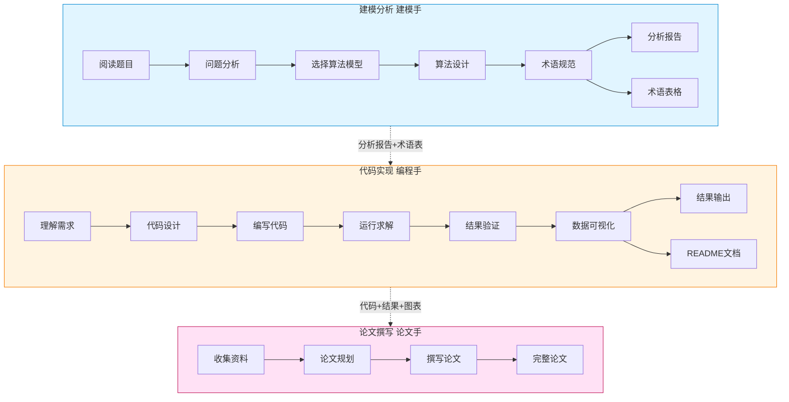

# 🎯 Math Modeling Skill

<div align="center">

**为数学建模竞赛和项目提供的结构化三阶段工作流程**

[](https://claude.com/claude-code)
[](LICENSE)

<br/>

**关注我**

<a href="https://blog.csdn.net/SJbeITenginner?spm=1010.2135.3001.5343" target="_blank">
  
</a>
<a href="https://www.zhihu.com/people/27-85-7-72-95/posts" target="_blank">
  
</a>
<a href="https://www.xiaohongshu.com/user/profile/6497dd69000000001c02ab98" target="_blank">
  
</a>

</div>

---

## 📖 简介

本技能为数学建模竞赛（CUMCM、MCM/ICM等）提供**建模分析 → 代码实现 → 论文撰写**三阶段协作工作流程，确保建模、编程、论文撰写三个环节紧密衔接，产出高质量的数学建模成果。

## 💡 创新指南

本技能鼓励创新和灵活性：

### 🔗 算法组合

- 可组合多个算法：如"灰色预测+神经网络"
- 参考不同类别的算法：如图论算法用于优化

### 🔍 题目特殊分析

- 当常规方法不适用时，灵活调整
- 分析题目独特性，选择或设计专门方法

### 📝 创新记录

- 在分析文档中说明选择理由
- 在论文中突出创新点

## ✨ 特性

- 🔄 **三阶段协作**：建模分析、代码实现、论文撰写，各司其职
- 📚 **算法资源库**：涵盖优化、预测、评价、图论、统计、综合、机器学习7大类60+算法
- 💻 **代码模板**：Python/MATLAB 双语言支持，符合 SCI/Nature 可视化标准
- 📄 **论文规范**：默认模板 + 自定义模板支持，符合竞赛格式要求
- 🛠️ **文档处理集成**：集成 docx、pdf、xlsx、paper_search 四个专业子skill，支持：
  - 📘 **docx skill**：创建、读取、编辑Word文档，生成标准格式论文
  - 📑 **pdf skill**：读取PDF题目、提取文本和表格数据
  - 📊 **xlsx skill**：处理Excel表格数据、结果输出，使用公式而非硬编码
  - 🔎 **paper_search skill**：通过OpenAlex API搜索学术论文，提供参考文献支持

## 🔄 工作流程



### 各阶段详细任务

|        阶段        | 任务                                                                                 | 产出                         |
| :----------------: | ------------------------------------------------------------------------------------ | ---------------------------- |
| **建模分析** | 题目分析、模型选择、算法设计、术语规范，使用pdf/xlsx skill读取题目和数据             | 分析报告 + 术语表            |
| **代码实现** | 代码编写、结果求解、结果验证、迭代改进、数据可视化、文档说明，使用xlsx skill处理表格 | 代码 + 结果 + 图表 + README  |
| **论文撰写** | 资料收集、论文规划、内容撰写，使用docx skill生成.docx格式论文                        | 完整论文（≥15000字，.docx） |

### 三角色介绍

本技能采用**三角色协作模式**，每个角色对应一个工作阶段：

|       角色       | 对应阶段 | 定位 | 核心能力             |
| :--------------: | :------: | ---- | -------------------- |
| **建模手** | 建模分析 | 大脑 | 数学建模、算法设计   |
| **编程手** | 代码实现 | 双手 | 代码实现、数据可视化 |
| **论文手** | 论文撰写 | 喉舌 | 学术写作、成果整理   |

**📘 建模手** - 团队的大脑

建模手负责将实际问题转化为数学模型，是整个建模过程的起点。主要工作包括：深入理解题目背景、判断问题类型、选择合适的数学模型和算法、设计求解思路、建立术语规范确保全文一致性。

**💻 编程手** - 团队的双手

编程手负责将建模手的理论设计转化为可运行的代码。主要工作包括：严格按照建模分析的思路编写代码、求解问题并验证结果、生成符合 SCI/Nature 标准的可视化图表、撰写项目说明文档。

**📝 论文手** - 团队的发言人

论文手负责将前两个阶段的工作成果整理成规范的学术论文。主要工作包括：收集分析建模文档和代码结果、规划论文章节结构、撰写符合竞赛规范的完整论文（≥15000字）、确保图表引用正确、格式规范。

## 🚀 快速开始

### 📦 安装

#### 方法一：通过 npx 一键安装（推荐）

```bash
npx skills add https://github.com/XiaoMaColtAI/math-modeling-skill.git
```

这是最简单的安装方式，会自动将技能安装到正确的目录。

#### 方法二：通过 Git 克隆

```bash
# 克隆到 Claude Code 的 skills 目录
git clone https://github.com/XiaoMaColtAI/math-modeling-skill.git ~/.claude/skills/math-modeling-skill
```

#### 方法三：手动安装

1. 下载本项目的 [ZIP 文件](https://github.com/XiaoMaColtAI/math-modeling-skill/archive/refs/heads/main.zip) 或克隆到本地
2. 将 `math-modeling-skill` 文件夹复制到对应工具的 skills 目录：

   **Claude Code:**
   - **macOS/Linux**: `~/.claude/skills/`
   - **Windows**: `%USERPROFILE%\.claude\skills\`

   **OpenClaw:**
   - **Windows**: `%USERPROFILE%\.openclaw\workspace\skills\` 或 `%USERPROFILE%\.openclaw\skills\`

3. 确保文件夹结构如下：

```
math-modeling-skill/
├── SKILL.md              # 技能定义文件
├── README.md             # 说明文档
├── assets/               # 算法资源库
├── references/           # 各阶段说明文档
└── tools/                # 集成的子Skill
```

#### ✅ 验证安装

重启 Claude Code 或重新加载 skills 后，在对话中输入：

```
/math-modeling
```

如果安装成功，该技能将被激活。

---

### ▶️ 使用

#### 基础用法

在 Claude Code 中，你可以通过以下方式使用 Math Modeling Skill：

**1. 直接调用技能**

```
/math-modeling 帮我做这道数学建模题
```

**2. 在对话中使用**

```
用户: "帮我分析这道数模题目用什么模型"

Claude:
1. 📋 建模分析：分析题目，选择模型
2. 💻 代码实现：编写代码，求解结果
3. 📝 论文撰写：撰写完整论文
```

**3. 分阶段使用**

```
/math-modeling 进行建模分析
/math-modeling 进行代码实现
/math-modeling 进行论文撰写
```

> **⚠️ 重要提示**
>
> AI 生成的论文具有明显的"AI 味道"，容易被检测工具识别为 AI 生成内容。**请勿直接使用 AI 生成的全文**，建议：
>
> - 将 AI 生成的内容作为参考和框架
> - 结合自己的理解和分析进行修改润色
> - 添加个人见解和创新点
> - 调整表述风格，使其更符合个人写作习惯

---

## ⚙️ 配置说明

### 🔎 Paper Search 邮箱配置

`paper_search` skill 使用 **OpenAlex API** 搜索学术论文，需要提供邮箱地址以使用礼貌池（Polite Pool）提高API访问限制。

#### API 信息

| 项目               | 说明                       |
| ------------------ | -------------------------- |
| **API 地址** | https://api.openalex.org   |
| **文档**     | https://docs.openalex.org/ |
| **认证方式** | 无需API Key，仅需提供邮箱  |
| **费用**     | 完全免费                   |

#### 邮箱配置方法

**1. 命令行运行脚本时传入**

```bash
python tools/paper_search/scripts/openalex_scholar.py \
  --query "grey prediction model" \
  --email "your-email@example.com"
```

**2. 代码中调用时传入**

```python
from openalex_scholar import OpenAlexScholar

# 初始化时传入邮箱
scholar = OpenAlexScholar(email="your-email@example.com")
papers = scholar.search_papers("linear programming optimization")
```

**3. 在三角色文档中使用**

建模手和论文手在使用 `paper_search skill` 时，需要按上述方式提供邮箱地址。建议在建模分析阶段统一配置好邮箱，后续搜索时自动使用。

#### 注意事项

- 📧 邮箱必须是有效的邮箱地址格式
- 🚀 使用礼貌池可提高API访问速率和限制
- 🔒 OpenAlex 仅将邮箱用于速率限制管理，不会发送垃圾邮件

---

## 📂 目录结构

```
math-modeling-skill/
├── SKILL.md                    # 技能主文档
├── README.md                   # 本文件
├── assets/                     # 算法资源库
│   ├── README.md              # 算法快速索引
│   ├── 01-优化算法说明.md
│   ├── 02-预测类算法说明.md
│   ├── 03-评价类算法说明.md
│   ├── 04-图论与网络分析算法说明.md
│   ├── 05-统计分析与数据处理算法说明.md
│   ├── 06-综合类算法说明.md
│   └── 07-机器学习算法说明.md
├── references/                  # 各阶段说明文档
│   ├── roles/                 # 角色说明文件夹
│   │   ├── 建模手说明.md      # 建模分析阶段工作细则
│   │   ├── 编程手说明.md      # 代码实现阶段工作细则
│   │   └── 论文手说明.md      # 论文撰写阶段工作细则
│   ├── Outstanding Thesis/    # 优秀论文资源库
│   │   ├── CUMCM/             # 国赛优秀论文
│   │   └── 2017MCM ICM/       # 美赛O奖论文（A-F题）
│   ├── 论文模板.docx          # 标准论文模板（.docx格式）
│   └── README.md              # 三角色工作指南
├── tools/                      # 集成的子Skill
│   ├── docx/                  # Word文档处理Skill
│   ├── pdf/                   # PDF文档处理Skill
│   ├── xlsx/                  # Excel表格处理Skill
│   └── paper_search/          # 论文搜索Skill
└── scripts/                    # 工具脚本（已废弃，使用xlsx skill替代）
```

## 🧮 算法覆盖

| 类别          | 算法数量 | 代表算法                                                             |
| ------------- | -------- | -------------------------------------------------------------------- |
| ⚙️ 优化算法 | 15       | 线性规划、遗传算法、PSO、模拟退火、鲸鱼优化、麻雀搜索、多目标优化    |
| 📈 预测算法   | 11       | 灰色预测、ARIMA、神经网络、Prophet、LSTM、XGBoost/LightGBM、时空预测 |
| ⭐ 评价算法   | 11       | AHP、TOPSIS、熵权法、灰色关联、DEA、区间数评价、改进TOPSIS           |
| 🕸️ 图论网络 | 6        | 最短路径、最大流、MST、匹配问题                                      |
| 📊 统计分析   | 9        | K-Means、层次聚类、DBSCAN、SOM、GMM、PCA、因子分析、CCA、NMF         |
| 🎲 综合算法   | 6        | 蒙特卡洛、排队论、博弈论、马尔科夫链、微分方程                       |
| 🤖 机器学习   | 3        | 随机森林、AdaBoost、孤立森林                                         |

## 🏆 适用竞赛

- 🇨🇳 全国大学生数学建模竞赛 (CUMCM)
- 🌍 美国大学生数学建模竞赛 (MCM/ICM)
- 🎓 研究生数学建模竞赛
- 📚 其他数学建模竞赛和项目

---

## 📋 更新日志

### v2.0 (2025-02)

#### ✨ 重大更新：论文AI味去除系统

针对AI生成论文容易被检测工具识别的问题，本次更新在 `references/roles/论文手说明.md` 中加入了完整的**去AI味写作指南**，基于Wikipedia的"Signs of AI writing"研究整理：

**七大类AI痕迹识别与去除：**

1. **内容模式去AI化**

   - 消除"标志着/重要的是/关键作用"等过度强调词汇
   - 去除"独立报道/专家认为"等模糊归因
   - 避免"不仅...而且..."等公式化平行结构
   - 删除"突破性的/令人惊叹的"等广告式宣传语
2. **语言语法规范化**

   - 控制"此外/关键的/深入探讨"等AI高频词汇使用
   - 避免"拥有/具有"等复杂结构替代简单系动词
   - 破除强行分组的"三法则"套路
   - 消除同义词过度替换（"模型/算法/方法/方案"循环）
3. **写作风格真实化**

   - 减少破折号和粗体的过度使用
   - 避免内联标题垂直列表（**准确性：** 95%）
   - 删除表情符号和装饰性元素
   - 用具体数据替代模糊积极结论
4. **数学建模论文专用规范**

   - 禁用"深入探讨/充分展示/具有重要意义"等空泛表达
   - 用"准确率达到95.6%，比基准方法高8.2%"替代"结果令人振奋"
   - 要求每句话都有具体数据或信息支撑
   - 承认复杂性和局限性，注入真实分析思考

**完整自查清单**（论文手必须遵守）：

- [ ] 是否使用了AI高频词汇？
- [ ] 是否过度使用破折号、粗体？
- [ ] 是否有"不仅...而且..."结构？
- [ ] 是否强行将内容分成三组？
- [ ] 是否有模糊的"专家认为"？
- [ ] 是否有公式化的"挑战与展望"？
- [ ] 每句话是否都有具体数据支撑？

---

#### 🛠️ 新增四个专业子Skill

原 `scripts/` 目录已移除，功能由以下专业子Skill替代：

| 子Skill                  | 功能                      | 使用场景                       |
| ------------------------ | ------------------------- | ------------------------------ |
| 📑`tools/pdf`          | PDF文档读取、文本表格提取 | 读取比赛题目、学习优秀论文     |
| 📊`tools/xlsx`         | Excel表格处理、公式计算   | 处理题目数据、输出结果表格     |
| 📘`tools/docx`         | Word文档生成、模板编辑    | 生成标准格式论文               |
| 🔎`tools/paper_search` | OpenAlex学术文献搜索      | 自动生成参考文献（需配置邮箱） |

**⚠️ Paper Search 配置提醒**：使用 `paper_search skill` 前需配置邮箱，详见上方【⚙️ 配置说明】部分。

**三角色必须正确使用对应skill：**

- 🧠 **建模手**：使用 `pdf skill` 读题目、`xlsx skill` 分析数据、`paper_search skill` 搜索文献
- 💻 **编程手**：使用 `xlsx skill` 处理Excel数据、使用公式而非硬编码
- ✍️ **论文手**：使用 `docx skill` 生成.docx格式论文、使用 `paper_search skill` 交叉验证文献

---

#### 🏆 优秀论文资源库扩充

新增 `references/Outstanding Thesis/` 目录：

**🇨🇳 国赛优秀论文 (CUMCM)** - 9篇

- 🚛 RGV动态调度优化系列（3篇）
- 👥 百货商场会员画像描绘系列（2篇）
- 🚗 汽车总装线配置系列（3篇）
- 🌡️ 高温作业专用服装设计（1篇）

**🌍 美赛O奖论文 (2017MCM ICM)** - 27篇

- 📈 A题连续型（4篇）
- 📊 B题离散型（5篇）
- 💡 C题数据洞察（4篇）
- 🕸️ D题运筹网络（5篇）
- 🌱 E题环境科学（5篇）
- 📋 F题政策分析（4篇）

---

#### 📚 三角色说明文档全面增强

| 角色文档                    | 新增内容                                                                                                        |
| --------------------------- | --------------------------------------------------------------------------------------------------------------- |
| 🧠**建模手说明.md**   | 增加pdf/xlsx/paper_search skill详细使用方法、文献记录要求、算法资源库索引                                       |
| 💻**编程手说明.md**   | 增加xlsx skill公式处理、Python/MATLAB库速查表、SCI/Nature可视化标准                                             |
| ✍️**论文手说明.md** | **重点增加去AI味写作指南**、docx skill使用教程、图文并茂规范（每张图≥100字分析）、人称约束、叙述方式规范 |

---

#### 🔧 算法文档改进

- ✅ 修正了所有算法文档中的文献引用格式
- 🔎 新增 `paper_search skill` 支持通过OpenAlex API自动搜索学术论文
- 📖 优化了 `assets/README.md` 算法快速索引

---

### 🎉 v1.0 (2025-01)

- 🎊 初始版本发布
- 🔄 基础三阶段工作流程：建模分析 → 代码实现 → 论文撰写
- 📚 7大类60+算法资源库
- 👥 基础角色分工文档

---

## 📄 许可证

MIT License

---

<div align="center">

**[算法资源库](assets/README.md)** · **[使用文档](SKILL.md)** · **[角色说明](references/roles/)**

</div>
